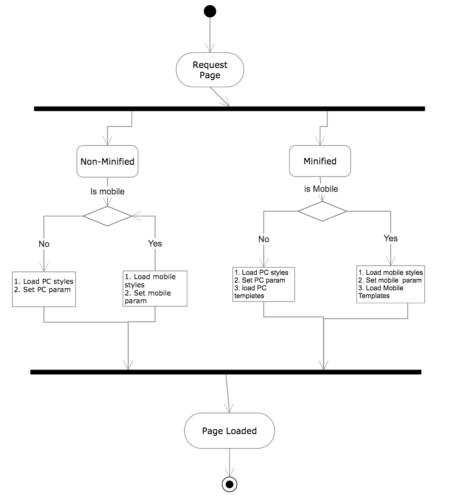

###################
Client Architecture
###################
For the client we use Angular framework which favours an m-v-vm pattern. The applicaiton 
is a Single page application and leverages the underlying framework to provide routing, DI, 
data binding and XHR requests.

Bootstrapping
+++++++++++++
Currently we only support browser based clients. To determine whether the request is originating 
from a mobile or a desktop device we use the device type parameter in the request header and based on that we serve the 
relevant code.Once angular code is loaded it then activates the relevant Controller 
based on the passed URL and view rendering proceeds.

   
Mobile vs Desktop
-----------------
The mobile and desktop client share the same application code. The only difference is the view template and the 
styling files used. 

The server sets a global JS parameter based on the device type. This parameter will then be available through the entire application 
and is used to call the templates to render. Also, on the server side based on the device type, an include statement determines which 
style file to include and in the case the code is minified, which compiled template js file to use.

.. note::
   This is not the most ideal solution since it is unaware of the display size on the client which would be a better parameter to use
   to determine which view to serve to the user. However to have this solution would need an extra trip to the server before the application
   can be loaded which would cause a delay. To mitigate this the views are designed to be responsive so that the experience at least degrades
   gracefully
 
.. note::
   The differentiation between mobile and desktop is only on Customer interface. Admin interface is desktop only.

Theme Selection
---------------
.. todo::
   This will need to be documented on how it is currently implemented
   
   

   

Minification
++++++++++++
Code deployed on development environments is usually not minified to enable debugging and inspection from the browser. Code served on 
production and staging environments is minified. The minified file name contains a mobile or desktop string and a checksum for the file 
to prevent caching of old files on the browser. Further the JS files are broken into a number of files instead of 1 large file. This is to make some 
of the JS files cacheable (libraries mostly which rarely change). This does not impact load time actually to the contrary since 
most browsers can load upto 6 files from the same domain in parallel.

Styling
+++++++
Styling are broken down into mobile and desktop style sheets. The styles are written in SASS and compiled to CSS at application build time.
kindly see the devguide section on styling for further info *add link to dev styling section*
