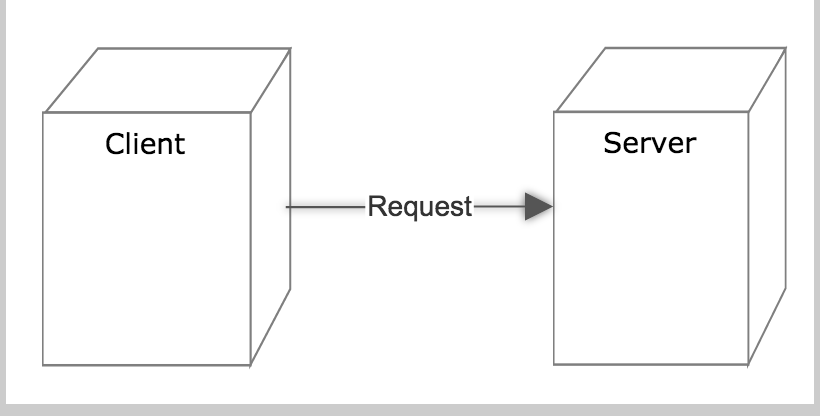
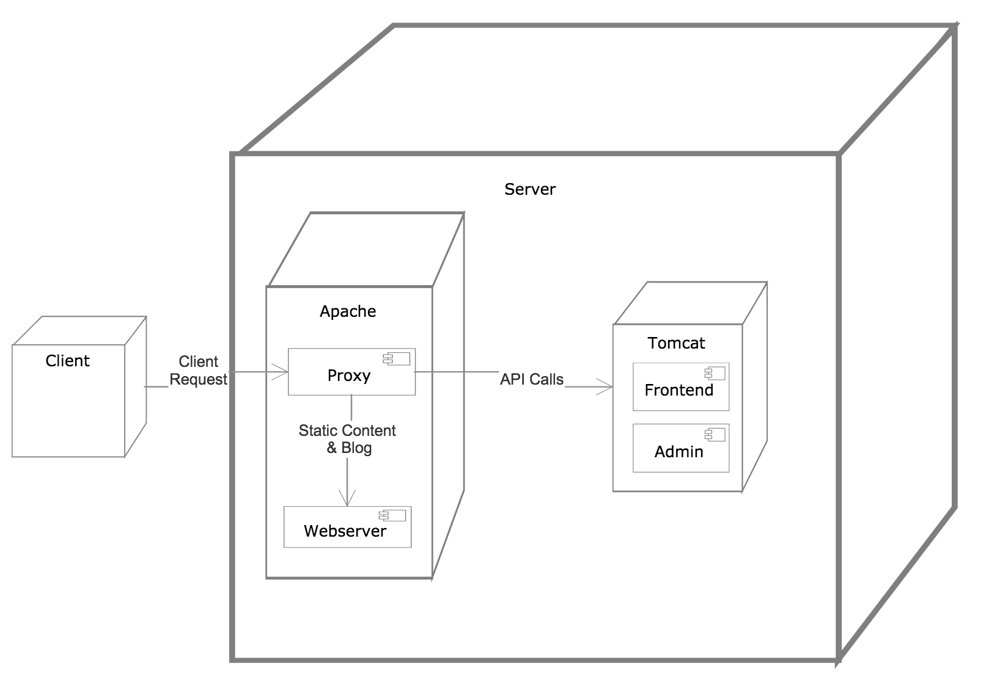
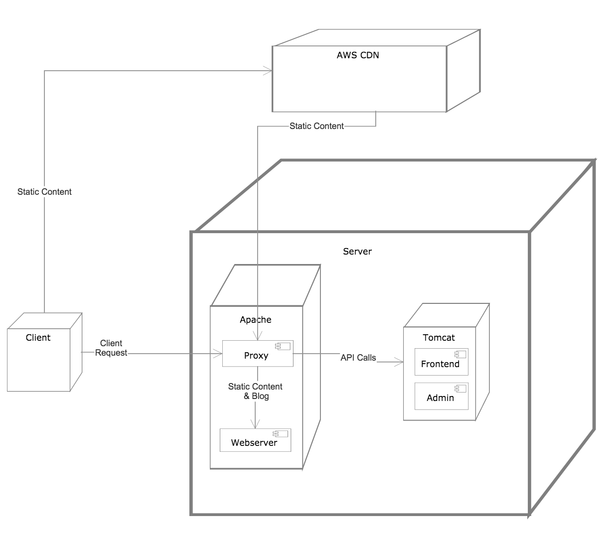

#######
Overall
#######

Without Proxy
+++++++++++++
This is when the application is accessed directly without optimisations via a proxy. This is 
mostly in the development environment

With Proxy
++++++++++
Deployement to inhouse and production go through a proxy server. This was done for 3 primary reasons:

   #. Share port 80 with other appliations(PHP) that need to be accessed by site users
   #. use Apaches optimized static content serving 
   #. in case necessary use the proxy server as a load balancer and connect to multiple backends
   

With Proxy and CDN
++++++++++++++++++
We use Amazon cloudfront as our CDN. This was primarily done to offload static content serving from our 
server and have those processed by the CDN. This is only used in production environment

