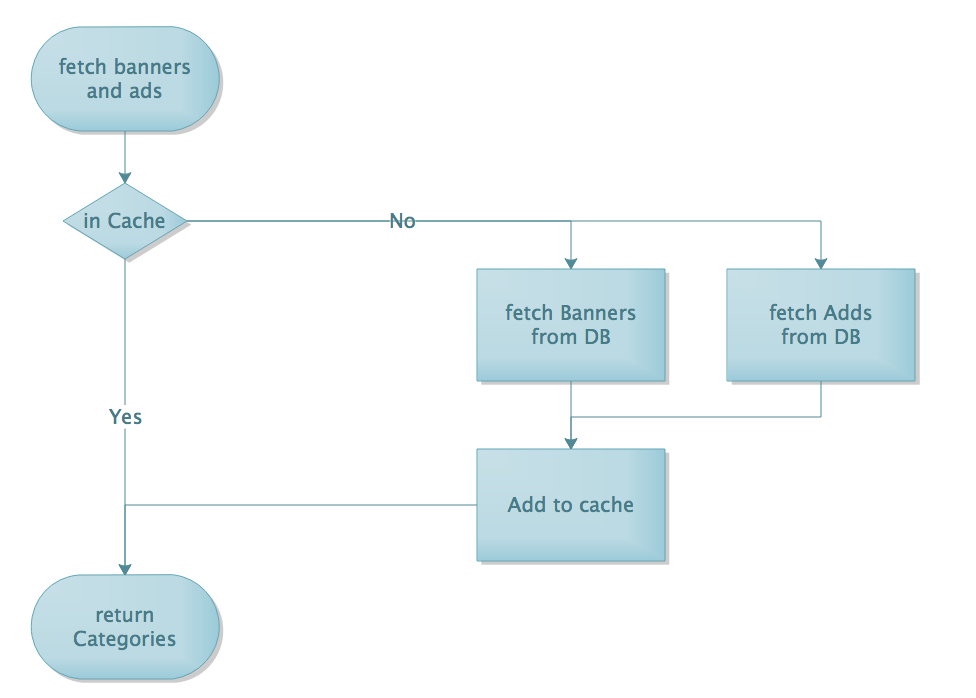

########
Shopping
########

Homepage
++++++++
Loading the homepage involves below steps

Load Categories
---------------
This loads a map of the categories. The map represents the categories' hierarchy with the key being the 
parent category and the value representing the subcategories. The process loads the category hierarchy from 
cache if already cached. Otherwise it hits the DB fetches the categories caches the result for future requests 
and returns final result. 

The call returns only active categories sorted according to their priority field 
``/api/categories/{storeId}``

Load homepage banner carousel & homepage adds
---------------------------------------------
This loads the carousel banner ads that display on the homepage and any category ads. The ads fetched
have to be in active status and are sorted based on their priority field. Each Ad placement location is called an AdSlot. For example on the 
homepage we have the HomePageBanner slot and the HomePage adSlots. The content that shows within a slot is called an Ad. The slots have a priority 
field to show which has the highest precedence. The ads also have a priority field to control how they are dispayed on the UI.
``/api/placements/landingPage``

Search autosuggest
++++++++++++++++++
The autosuggest feature for the search allows the user to start typing and after three letters provides a list of 
possible hits and the categories they appear in.   

Search Page
+++++++++++

Load search results
___________________
 pagination filters are handled here
 

Categories Page
+++++++++++++++

Load category banner
--------------------
The loads the category related banner with the highest priority. If there is no banner configured for the subcategory 
then the default banner is loaded ``/api/placements/{subCategoryId}/getCatBanner``

Load category products
----------------------
pagination and filters are handled here

Add to cart
-----------

increment in cart
-----------------

remove from cart
----------------

Product Page
++++++++++++

Shopping Cart
+++++++++++++

Fetch cart
----------

